# Catalog

## Inheritance and relations graph

Solid arrows = inherits from (`extends`). Dashed arrows = links to (`relations`).

```mermaid
graph TD
  %% ── Inheritance ──────────────────────────────────────────────
  person --> expert
  process --> manufacturing-process
  process --> characterization-process
  characterization-process --> tensile-test
  batch --> specimen-batch
  batch --> metal-sheet-batch
  semi-finished-product --> metal-sheet
  specimen --> flat-specimen
  specimen --> creep-specimen

  %% ── Relations (dashed) ───────────────────────────────────────
  expert        -.->|employer / department| organization
  expert        -.->|knows| expert
  expert        -.->|expertise in| material
  expert        -.->|expertise in| measurement-device
  organization  -.->|sub-org of| organization
  specimen      -.->|source| semi-finished-product
  specimen-batch -.->|source| semi-finished-product
  metal-sheet-batch -.->|made of| material
  metal-sheet-batch -.->|supplier| organization
  semi-finished-product -.->|made of| material
  semi-finished-product -.->|supplier| organization
  chemical-composition -.->|composition of| material
  chemical-composition -.->|composition of| specimen
  measurement-device   -.->|responsible org| organization
  manufacturing-process -.->|operator| expert
  manufacturing-process -.->|input / output| material
  manufacturing-process -.->|process data| dataset
  characterization-process -.->|operator ✱| expert
  characterization-process -.->|instrument ✱| measurement-device
  characterization-process -.->|specimen ✱| specimen
  characterization-process -.->|result data| dataset
  material-card -.->|describes ✱| material
  material-card -.->|includes| characterization-process
  material-card -.->|includes| tensile-test
  material-card -.->|includes| chemical-composition
  project -.->|coordinator / participants| expert
  project -.->|partner orgs / funder| organization
  project -.->|publications| document

  %% ── Styling ──────────────────────────────────────────────────
  classDef agent      fill:#dbeafe,stroke:#3b82f6
  classDef material   fill:#dcfce7,stroke:#22c55e
  classDef process    fill:#fef9c3,stroke:#eab308
  classDef equipment  fill:#fce7f3,stroke:#ec4899
  classDef data       fill:#f3f4f6,stroke:#6b7280
  classDef research   fill:#ede9fe,stroke:#8b5cf6
  classDef batch      fill:#ffedd5,stroke:#f97316
  classDef physical   fill:#ecfdf5,stroke:#10b981

  class person,expert,organization agent
  class material,chemical-composition material
  class specimen,flat-specimen,creep-specimen,semi-finished-product,metal-sheet physical
  class process,manufacturing-process,characterization-process,tensile-test process
  class measurement-device equipment
  class dataset,document,app,material-card data
  class project research
  class batch,specimen-batch,metal-sheet-batch batch
```

✱ = required relation

---

## Registry

| ID | Name | Extends | Ontologies | Semantic schemas | Links to | Tags |
|---|---|---|---|---|---|---|
| [app](k-types/app/) | App | | schema.org | | | software |
| [batch](k-types/batch/) | Batch | | W3C PROV | | | batch |
| [characterization-process](k-types/characterization-process/) | Characterization Process | process | OBI, PMDCo | characterization/generic/PMDCo v0.1.0 | expert ✱, measurement-device ✱, specimen ✱, dataset | process, characterization |
| [chemical-composition](k-types/chemical-composition/) | Chemical Composition | | PMDCo | chemical-composition/PMDCo v0.1.0, chemical-composition/BWMD v0.1.0 | material, specimen | material, composition |
| [creep-specimen](k-types/creep-specimen/) | Creep Specimen | specimen | PMDCo, OBI | specimen/PMDCo v0.3.0 (inherited) | semi-finished-product (inherited) | specimen |
| [dataset](k-types/dataset/) | Dataset | | DCAT | | | data |
| [document](k-types/document/) | Document | | DCTERMS, schema.org | | | data |
| [expert](k-types/expert/) | Expert | person | EMMO | expertise/VIVO v0.2.0 | organization, expert, material, measurement-device | agent, person |
| [flat-specimen](k-types/flat-specimen/) | Flat Specimen | specimen | PMDCo, OBI | specimen/PMDCo v0.3.0 (inherited) | semi-finished-product (inherited) | specimen |
| [manufacturing-process](k-types/manufacturing-process/) | Manufacturing Process | process | PMDCo | manufacturing/generic/PMDCo v0.1.0 | expert, material, dataset | process, manufacturing |
| [material](k-types/material/) | Material | | PMDCo, EMMO | | | material |
| [material-card](k-types/material-card/) | Material Card | | PMDCo | material-card/mechanical/PMDCo v0.1.0, workflow/OBI v0.1.0, specimen/PMDCo v0.3.0, chemical-composition/PMDCo v0.1.0 | material ✱, characterization-process, tensile-test, chemical-composition | material, data |
| [measurement-device](k-types/measurement-device/) | Measurement Device | | OBI, PMDCo | measurement-device/PMDCo v0.1.0 | organization | equipment |
| [metal-sheet](k-types/metal-sheet/) | Metal Sheet | semi-finished-product | BFO | | material, organization (inherited) | semi-finished-product |
| [metal-sheet-batch](k-types/metal-sheet-batch/) | Metal Sheet Batch | batch | PMDCo, W3C PROV | | material, organization | batch, metal-sheet |
| [organization](k-types/organization/) | Organization | | W3C-ORG, FOAF, schema.org | | organization | agent |
| [person](k-types/person/) | Person | | FOAF, schema.org | | | agent, person |
| [process](k-types/process/) | Process | | PMDCo | | | process |
| [project](k-types/project/) | Project | | VIVO, schema.org | | expert, organization, document | project, research |
| [semi-finished-product](k-types/semi-finished-product/) | Semi-Finished Product | | BFO | | material, organization | semi-finished-product |
| [specimen](k-types/specimen/) | Specimen | | PMDCo, OBI | specimen/PMDCo v0.3.0 | semi-finished-product | specimen |
| [specimen-batch](k-types/specimen-batch/) | Specimen Batch | batch | PMDCo, W3C PROV | | semi-finished-product | batch, specimen |
| [tensile-test](k-types/tensile-test/) | Tensile Test | characterization-process | SteelPO, TTO | characterization/tensile-test/TTO v0.1.0, characterization/tensile-test/PMDCo v0.1.0 | *(all inherited)* | process, characterization, mechanical-testing |

✱ = required relation
