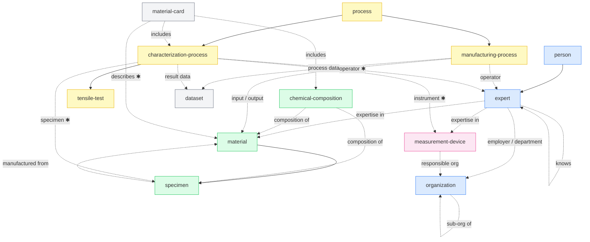

# Catalog

## Inheritance and relations graph

Solid arrows = inherits from (`extends`). Dashed arrows = links to (`relations`).

✱ = required relation

---

## Registry

| ID | Name | Extends | Ontologies | Semantic schemas | Links to | Tags |
|---|---|---|---|---|---|---|
| [app](k-types/app/) | App | | schema.org | | | software |
| [characterization-process](k-types/characterization-process/) | Characterization Process | process | OBI, PMDCo | characterization/process/PMDCo v1.0.0, characterization/step/base/PMDCo v2.0.0 | expert ✱, measurement-device ✱, specimen ✱, dataset | process, characterization |
| [chemical-composition](k-types/chemical-composition/) | Chemical Composition | | PMDCo | chemical-composition/PMDCo v1.0.0, chemical-composition/BWMD v1.0.0 | material, specimen | material, composition |
| [dataset](k-types/dataset/) | Dataset | | DCAT | | | data |
| [document](k-types/document/) | Document | | DCTERMS, schema.org | | | data |
| [expert](k-types/expert/) | Expert | person | EMMO | expertise/schema.org v1.0.0 | organization, expert, material, measurement-device | agent, person |
| [manufacturing-process](k-types/manufacturing-process/) | Manufacturing Process | process | PMDCo | manufacturing/step/base/PMDCo v2.0.0 | expert, material, dataset | process, manufacturing |
| [material](k-types/material/) | Material | | PMDCo, EMMO | | | material |
| [material-card](k-types/material-card/) | Material Card | | PMDCo | material-card/mechanical/PMDCo v1.0.0, workflow/PMDCo v1.1.0, specimen/PMDCo v1.0.0, chemical-composition/PMDCo v1.0.0 | material ✱, characterization-process, chemical-composition | material, data |
| [measurement-device](k-types/measurement-device/) | Measurement Device | | OBI, PMDCo | measurement-device/PMDCo v1.0.0 | organization | equipment |
| [organization](k-types/organization/) | Organization | | W3C-ORG, FOAF, schema.org | | organization | agent |
| [person](k-types/person/) | Person | | FOAF, schema.org | | | agent, person |
| [process](k-types/process/) | Process | | PMDCo | | | process |
| [specimen](k-types/specimen/) | Specimen | material | PMDCo, OBI | specimen/PMDCo v1.0.0 | material | material, specimen |
| [tensile-test](k-types/tensile-test/) | Tensile Test | characterization-process | SteelPO, TTO | characterization/step/tensile-test/TTO v3.0.2, characterization/step/tensile-test/PMDCo v1.1.0 | *(all inherited)* | process, characterization, mechanical-testing |

✱ = required relation
