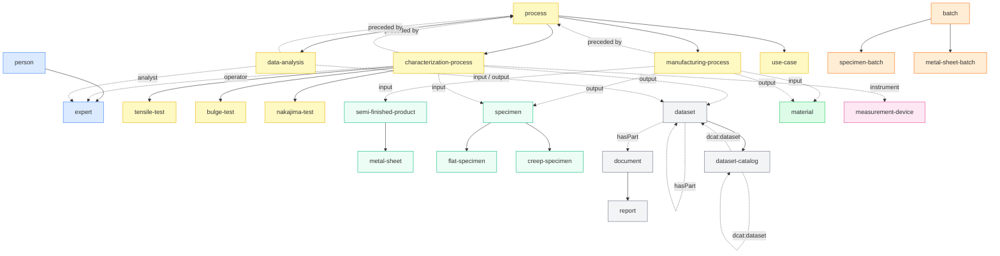

# Catalog

## Inheritance and connections graph

Solid arrows = inherits from (`extends`). Dashed arrows = links to (via `x-kitem` in semantic schemas).

---

## Registry

| ID | Name | Extends | Ontologies | Semantic schemas | Connects to (via x-kitem) | Tags |
|---|---|---|---|---|---|---|
| [app](k-types/app/) | App | | schema.org | | | software |
| [batch](k-types/batch/) | Batch | | W3C PROV | | | batch |
| [bulge-test](k-types/bulge-test/) | Bulge Test | characterization-process | OBI | characterization/generic/PMDCo v0.2.0 | specimen (in), dataset (out), expert (inherited), measurement-device (inherited) | process, characterization, forming |
| [nakajima-test](k-types/nakajima-test/) | Nakajima Test | characterization-process | OBI | characterization/generic/PMDCo v0.2.0 | specimen (in), dataset (out), expert (inherited), measurement-device (inherited) | process, characterization, forming |
| [characterization-process](k-types/characterization-process/) | Characterization Process | process | OBI, CHAMEO | characterization/generic/PMDCo v0.2.0 | expert, measurement-device, specimen/material (in), specimen/dataset (out), process (preceded by) | process, characterization |
| [chemical-composition](k-types/chemical-composition/) | Chemical Composition | | PMDCo | chemical-composition/PMDCo v0.2.0, chemical-composition/BWMD v0.2.0 | | material, composition |
| [creep-specimen](k-types/creep-specimen/) | Creep Specimen | specimen | PMDCo, OBI | specimen/PMDCo v0.4.0 (inherited) | | specimen |
| [data-analysis](k-types/data-analysis/) | Data Analysis | process | OBI | data-analysis/generic/PMDCo v0.1.0 | dataset (in/out), expert, process | process, data, analysis |
| [dataset](k-types/dataset/) | Dataset | | DCAT | dataset/generic/DCAT v0.1.0 | dataset/document (dcterms:hasPart) | data, dataset |
| [dataset-catalog](k-types/dataset-catalog/) | Dataset Catalog | dataset | DCAT | dataset/catalog/DCAT v0.1.0 | dataset/dataset-catalog (dcat:dataset) | data, dataset, catalog |
| [document](k-types/document/) | Document | | DCTERMS, schema.org | | | data |
| [expert](k-types/expert/) | Expert | person | ORCHESTER | expertise/VIVO v0.3.0 | | agent, person |
| [flat-specimen](k-types/flat-specimen/) | Flat Specimen | specimen | PMDCo, OBI | specimen/PMDCo v0.4.0 (inherited) | | specimen |
| [manufacturing-process](k-types/manufacturing-process/) | Manufacturing Process | process | PMDCo | manufacturing/generic/PMDCo v0.2.0 | material/semi-finished-product (in), material/specimen (out), process (preceded by) | process, manufacturing |
| [material](k-types/material/) | Material | | PMDCo, EMMO | | | material |
| [material-card](k-types/material-card/) | Material Card | | ORCHESTER | material-card/mechanical/PMDCo v0.3.0, workflow/OBI v0.2.0, specimen/PMDCo v0.4.0, chemical-composition/PMDCo v0.2.0 | | material, data, material-card |
| [measurement-device](k-types/measurement-device/) | Measurement Device | | OBI, PMDCo, CHAMEO | measurement-device/PMDCo v0.2.0 | | equipment |
| [metal-sheet](k-types/metal-sheet/) | Metal Sheet | semi-finished-product | BFO | | | semi-finished-product |
| [metal-sheet-batch](k-types/metal-sheet-batch/) | Metal Sheet Batch | batch | PMDCo | | | batch, metal-sheet |
| [organization](k-types/organization/) | Organization | | W3C-ORG, FOAF, schema.org | | | agent |
| [person](k-types/person/) | Person | | FOAF, schema.org | | | agent, person |
| [process](k-types/process/) | Process | | BFO | | | process |
| [project](k-types/project/) | Project | | VIVO, schema.org | | | project, research |
| [report](k-types/report/) | Report | document | IAO | | | data, document, report |
| [semi-finished-product](k-types/semi-finished-product/) | Semi-Finished Product | | BFO | | | semi-finished-product |
| [specimen](k-types/specimen/) | Specimen | | OBI | specimen/PMDCo v0.4.0 | | specimen |
| [specimen-batch](k-types/specimen-batch/) | Specimen Batch | batch | PMDCo | | | batch, specimen |
| [tensile-test](k-types/tensile-test/) | Tensile Test | characterization-process | SteelPO, TTO | characterization/tensile-test/TTO v0.2.0, characterization/tensile-test/PMDCo v0.3.0 | specimen/material (in, inherited), specimen/dataset (out, inherited), expert (inherited), measurement-device (inherited) | process, characterization, mechanical-testing |
| [use-case](k-types/use-case/) | Use Case | process | OBI | | | use-case, workflow, campaign |
